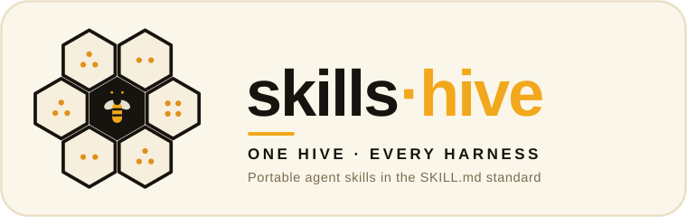
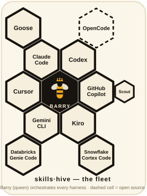

<p align="center">
  
</p>

# skills-hive

> **Harness-agnostic by design.** Skills here are portable `SKILL.md` files with
> no lock-in to any one agent — the same skill runs across Claude Code, Codex,
> Gemini CLI, GitHub Copilot (and Scout), Cursor, Goose, OpenCode, Kiro,
> Databricks Genie Code, and Snowflake Cortex Code.

*Part of the **[ai-hive](https://github.com/werkrbee/ai-hive)** family — werkrbee's House of Hives (skills · rules · tools · agents · and more).*

Personal agent skills for [werkrbee](https://github.com/werkrbee), packaged for **multiple AI coding harnesses** using the open [Agent Skills](https://agentskills.io) standard (`SKILL.md`).

One repo. Install into Cursor, Claude Code, Codex, GitHub Copilot, Gemini CLI, Goose, Kiro, Scout, Databricks Genie Code, Snowflake Cortex Code, and more.

## Skills

| Skill | Description |
|-------|-------------|
| [**barry**](skills/barry/) | The King Bee — chief of staff who decomposes goals, delegates to a fleet of agents, and synthesizes executive summaries |
| [**patricia**](skills/patricia/) | The Queen Bee — governance guardian who reviews plans and actions against the charter and gates consequential operations |

## Harnesses

<p align="center">
  
</p>

skills-hive installs into every major agent harness that reads the `SKILL.md`
standard. Barry is the king; each cell is a harness he orchestrates:

- **Frontier labs** — Claude Code (Anthropic), Codex (OpenAI), Gemini CLI (Google)
- **Hyperscalers** — GitHub Copilot (Microsoft), with **Scout** as a Windows
  sub-harness; Kiro (AWS)
- **Data & analytics** — Databricks Genie Code, Snowflake Cortex Code
- **Open source & independent** — Cursor, Goose (Block), OpenCode

See [Harness paths](#harness-paths) for exact install locations per harness.

## Repository layout

```text
skills-hive/
├── skills/                       # WHAT agents do — portable skills (source of truth)
│   └── barry/                    # king: the primary orchestrator skill
│       ├── SKILL.md
│       └── references/
│           ├── fleet.md          # the agent roster (logical roles)
│           └── harnesses/        # Barry's per-harness delegation notes
│               ├── claude-code.md
│               ├── cursor.md
│               ├── codex.md
│               ├── gemini-cli.md
│               ├── goose.md
│               ├── opencode.md
│               ├── kiro.md
│               ├── databricks-genie-code.md
│               ├── snowflake-cortex-code.md
│               └── github-copilot.md   # includes the Scout sub-harness
├── adapters/                     # WHERE skills run — harness taxonomy & overrides
│   ├── README.md
│   ├── claude-code/
│   ├── cursor/
│   ├── codex/
│   ├── gemini-cli/
│   ├── goose/
│   ├── opencode/                 # open-source peer harness
│   ├── kiro/                     # AWS (spec-driven; replaced Amazon Q)
│   ├── databricks-genie-code/    # data / analytics
│   ├── snowflake-cortex-code/    # data / analytics
│   └── github-copilot/
│       └── scout/                # sub-harness (child of GitHub Copilot)
├── scripts/
│   ├── install.sh                # macOS/Linux: copy skills into harness dirs
│   └── install.ps1               # Windows/Scout: junctions + m-settings.json
├── LICENSE
└── README.md
```

The repo separates two axes so the "king orchestrator" idea scales cleanly:

- **`skills/` is *what* agents do.** Each skill (Barry, and future ones) is a
  portable `SKILL.md` folder. It stays flat and harness-neutral so `install.sh`
  can copy `skills/barry/` into any harness without dragging platform-specific
  material along. Barry is the **king** — the orchestrator — and his per-harness
  delegation notes live *with* him as reference files under
  `skills/barry/references/harnesses/<harness>.md`, loaded on demand.
- **`adapters/` is *where* skills run.** This is the harness taxonomy and the home
  for any behavior override tied to a specific harness:
  `adapters/<harness>/`, with a **sub-harness** nested one level deeper as
  `adapters/<harness>/<sub-harness>/`.
- **Microsoft example:** Scout runs on the GitHub Copilot harness, so it sits at
  `adapters/github-copilot/scout/` — a child of its parent — and Barry's notes for
  it are a section inside `references/harnesses/github-copilot.md`.

Why not nest harness folders inside `skills/barry/`? Because installing Barry
copies that whole folder into each harness's skills dir — nested harness
directories would pollute every install, and they'd lock the harness list inside
one skill instead of sharing it across all of them.

## Install

### Option 1 — skills CLI (recommended)

Requires [Node.js](https://nodejs.org/). Installs from GitHub once this repo is pushed:

```bash
# All skills → Cursor (global)
npx skills add werkrbee/skills-hive --global -a cursor -y

# Barry only → multiple harnesses
npx skills add werkrbee/skills-hive --global \
  -a cursor -a claude-code -a codex -a github-copilot -a goose -a gemini-cli \
  -a opencode -a kiro \
  --skill barry -y

# List skills in repo without installing
npx skills add werkrbee/skills-hive --list
```

### Option 2 — install script (macOS / Linux)

```bash
git clone https://github.com/werkrbee/skills-hive.git
cd skills-hive
chmod +x scripts/install.sh

# Barry → global Cursor skills dir
./scripts/install.sh --global --harness cursor --skill barry

# All skills → Cursor + Claude Code (global)
./scripts/install.sh --global --all --harness cursor --harness claude-code
```

The script is written for macOS's default Bash 3.2 (no associative arrays).

### Option 3 — install script (Windows / Scout)

Windows harnesses use directory **junctions** instead of copies/symlinks — they
match how Scout and Copilot already link skills and need no Admin or Developer
Mode. For Scout, the script also enables `loadCopilotCliSkills` in
`m-settings.json`.

```powershell
.\scripts\install.ps1                 # link into every installed Windows harness
.\scripts\install.ps1 -DryRun         # preview only
.\scripts\install.ps1 -Only scout     # just Scout
.\scripts\install.ps1 -Force          # replace an existing target
```

### Option 4 — Cursor Remote Rule (Cursor 2.4+)

1. Cursor Settings → **Rules** → **Add Rule** → **Remote Rule (GitHub)**
2. Enter: `https://github.com/werkrbee/skills-hive`
3. Select skills to import

### Option 5 — manual copy

```bash
cp -R skills/barry ~/.cursor/skills/barry
```

## Harness paths

| Harness | Global path | Project path |
|---------|-------------|--------------|
| Cursor | `~/.cursor/skills/` | `.cursor/skills/` or `.agents/skills/` |
| Claude Code | `~/.claude/skills/` | `.claude/skills/` |
| OpenAI Codex | `~/.codex/skills/` | `.agents/skills/` |
| GitHub Copilot | `~/.copilot/skills/` | `.agents/skills/` |
| Gemini CLI | `~/.gemini/skills/` | `.agents/skills/` |
| Goose | `~/.config/goose/skills/` | `.goose/skills/` |
| OpenCode | `~/.config/opencode/skills/` | `.agents/skills/` |
| Kiro (AWS) | `~/.kiro/skills/` † | `.kiro/skills/` or `.agents/skills/` † |
| Scout (Windows) | `%USERPROFILE%\.scout\skills\` | — |
| Databricks Genie Code | workspace-based ‡ | `.agents/skills/` ‡ |
| Snowflake Cortex Code | workspace-based ‡ | `.agents/skills/` ‡ |

Many harnesses also read `~/.agents/skills/` as a shared fallback.

† Kiro paths are best-effort — confirm against current AWS Kiro docs.
‡ Databricks Genie Code and Snowflake Cortex Code are **data / analytics**
harnesses; skills are provisioned in the platform workspace (publish-based, like
Foundry) rather than a local home directory. Confirm the exact mechanism in
their docs.

### Which "Copilot"? (and Microsoft's other AI surfaces)

The installer targets **GitHub Copilot** — the coding agent (VS Code / CLI /
cloud) that reads file-based skills from `~/.copilot/skills` and `.github/skills/`.
Microsoft's other AI surfaces are different products with different extension
models, so they're intentionally not in the install scripts:

- **Microsoft Foundry agents** and **Copilot Studio** (GitHub Copilot harness)
  can run these same portable `SKILL.md` files, but they load them from a
  project/deployment `skills/` folder at session start — you *publish* skills to
  them rather than linking into a home directory.
- **Microsoft 365 Copilot** extends via declarative agents / Graph connectors,
  not file-based skills, so it's out of scope here.

## Using Barry

Invoke by name in any harness where the skill is installed:

- *"Barry, map the auth system and fix the session timeout."*
- *"Chief of staff: get this PR merge-ready."*
- *"Orchestrate agents in parallel to review my changes."*

Barry is harness-agnostic: the intake → plan → delegate → synthesize loop applies
everywhere. The agent/skill/model names in Barry are logical roles — each harness
supplies its own equivalents (see [`skills/barry/references/fleet.md`](skills/barry/references/fleet.md)).

## Adding a skill

1. Create `skills/<skill-name>/SKILL.md` with YAML frontmatter (`name`, `description`).
2. Add optional `references/`, `scripts/` as needed.
3. Update the skills table in this README.
4. Run `./scripts/install.sh --global --harness cursor --skill <skill-name>` or use `npx skills add`.

## Sync with local development

While editing this repo, symlink for live reload:

```bash
ln -sf "$(pwd)/skills/barry" ~/.cursor/skills/barry
```

Or re-run install after changes.

## License

MIT — see [LICENSE](LICENSE).
